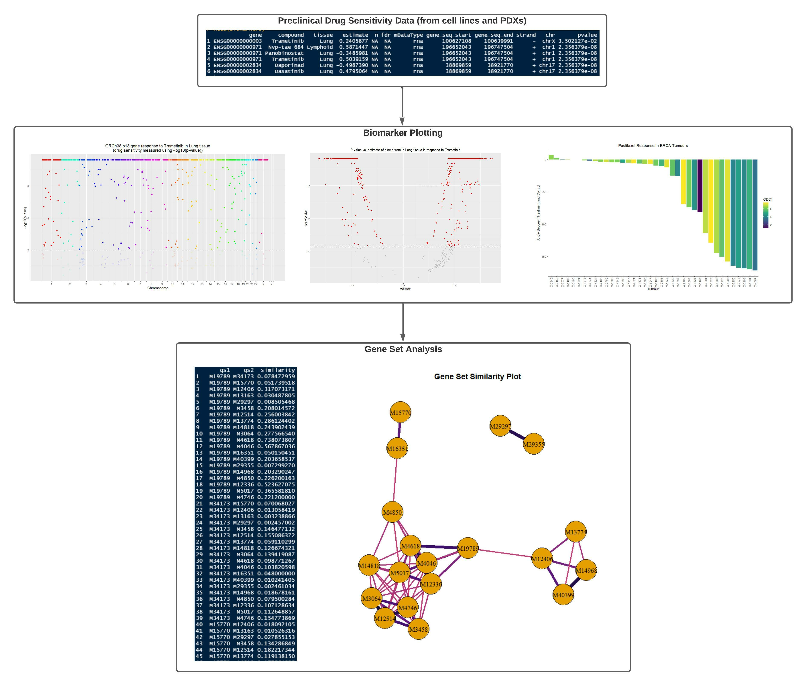

<!-- README.md is generated from README.Rmd. Please edit that file -->

# PGxVision

<!-- badges: start -->
<!-- badges: end -->

## Description

PGxVision (PharmacoGenomic Vision & Interpretation) helps identify and
visualize RNA-based cancer biomarkers for drug response. This package is
intended to be used in conjunction with the Roche-PharmacoGx pipeline.
PGxVision is intended to guide cancer treatment decisions in molecular
tumour boards.

``` r
R version 4.1.1 (2021-08-10)
Platform: x86_64-w64-mingw32/x64 (64-bit)
Running under: Windows 10 x64 (build 19043)
```

## Installation

To download the package:

``` r
require("devtools")
devtools::install_github("EvgeniyaGorobets/PGxVision")
library("PGxVision")
```

To run the shinyApp:

``` r
Under construction
```

## Overview

``` r
ls("package:PGxVision")
data(package = "PGxVision")
browseVignettes("PGxVision")
```

`PGxVision` contains eight functions and four sample data sets. Of the
eight functions, three are plotting functions for visualizing drug
sensitivity data, and five are gene set analysis functions that help
provide biological context for genes of interest.

An overview of the package is illustrated below.



### Biomarker Plotting

The *buildManhattanPlot* function visualizes gene response to a certain
drugs across the entire human genome. The x-axis represents the full
human genome and is labeled by chromosome, and the y-axis can either
plot the drug sensitivity or the p-value/fdr/significance of the drug
sensitivity statistic. As is the standard for Manhattan plots, data
points are colored according to what chromosome they belong to.

The *buildVolcanoPlot* function lets you simultaneously visualize the
drug sensitivity and the p-value/significance of the sensitivity
statistic. As is standard for volcano plots, points that are
statistically insignificant are grayed out.

The *buildWaterfallPlot* function plots drug sensitivity (or other
similar metrics) across a range of tumours or a range of drugs. The
waterfall plot will order results according to the y-axis, so users can
quickly identify the most and least sensitive tumour-drug combinations.

You can learn more about how to use these plotting functions in the
Plotting Biomarkers section of the Visualizing and Interpreting
Biomarkers vignette.

### Gene Set Analysis

The gene set analysis in this package is broken down into four steps:

1.  *queryGene*: Given a gene ID, find all gene sets that contain that
    gene. Users can examine different types of gene sets, such as those
    based on biological pathways, cellular components, molecular
    function, etc.
2.  *expandGeneSets*: Using the gene set IDs retrieved in *queryGene*,
    get all other genes in those gene sets.
3.  *computeGeneSetSimilarity*: Using the fully expanded gene sets from
    *expandGeneSets*, compute the overlap between the gene sets. All
    gene sets will at least contain the initial query gene, so pairwise
    overlap will be non-zero. Currently, the package only supports
    similarity metrics based on the proportion of intersecting genes to
    total genes.
4.  *buildNetworkPlot*: Plot the gene sets that were retrieved in
    *queryGene*, using their similarity scores from
    *computeGeneSetSimilarity* as edge weights. Gene sets that have high
    overlap will be in closer proximity and will have thicker and darker
    edges between them.

In addition to these four functions, the *geneSetAnalysis* function is
provided to run the entire analysis described above. You can learn more
about how to use these gene set analysis functions in the Gene Set
Analysis section of the Visualizing and Interpreting Biomarkers
vignette.

### Sample Data

The *BRCA.PDXE.paxlitaxel.response* data set is a `data.frame` with
treatment vs. control angle data from BRCA PDXs (patient-derived
xenographs). It is used in the *buildWaterfallPlot* example and was
retrieved from the `Xeva` package.

The *Biomarkers* data set is a `data.frame` with drug
sensitivity/response data in various experiments involving cancer cell
lines (an experiment is a unique combination of a drug, tissue, and
molecular data type). This data set also contains the p-values for the
drug sensitivity statistics. It is used in the *buildManhattanPlot* and
*buildVolcanoPlot* examples and was retrieved from PharmacoDb.

The *GRCh38.p13.Assembly* data set is a `data.frame` containing basic
information about the GRCh38.p13 genome assembly. Most notably, it
includes the names and lengths of all the chromosomes. It is used in the
*buildManhattanPlot* function and was retrieved from Gencode.

The *TestGeneSets* data set is a `data.frame` containing 10 different
gene sets and all their constituent genes. This data set represents all
the gene sets in the “<GO::CC>” (GO cellular compartment) category that
gene ENSG00000012124 is a part of. It is used for testing and was
retrieved from MSigDb.

## Contributions

The author of the package is Evgeniya Gorobets.

`data.table` is used to transform `data.frame`s into `data.table`s in
some plotting and gene set analysis functions (*buildVolcanoPlot,
buildManhattanPlot, queryGene, expandGeneSets,
computeGeneSetSimilarity*). The `data.table` vignettes were used to
create cleaner syntax and optimize table manipulation.

`ggplot2` is used to create non-network plots (*buildVolcanoPlot,
buildManhattanPlot, buildWaterfallPlot*), and `igraph` is used to create
network plots (*buildNetworkPlot*). `ggprism` is used to enhance the
axes on the Manhattan plot (*buildManhattanPlot*). `viridis` is used to
enhance the colors on the network plot (*buildNetworkPlot*).

`checkmate` is used to succinctly check user input in all functions.

`msigdbr` is used to query the MSigDb in gene set analysis functions
(*queryGene, expandGeneSets*).

## References

### Package References

Csardi, G., Nepusz, T. (2006). The igraph software package for complex
network research, *InterJournal, Complex Systems 1695.*
<https://igraph.org>

Dawson, C. (2021). ggprism: A ‘ggplot2’ Extension Inspired by ‘GraphPad
Prism’. R package version 1.0.3.
<https://CRAN.R-project.org/package=ggprism>

Dolgalev, I. (2021). msigdbr: MSigDB Gene Sets for Multiple Organisms in
a Tidy Data Format. R package version 7.4.1.
<https://CRAN.R-project.org/package=msigdbr>

Dowle, M., and Srinivasan, A. (2021). data.table: Extension of
`data.frame`. R package version 1.14.2.
<https://CRAN.R-project.org/package=data.table>.

Garnier, S., Ross, N., Rudis, R., Camargo, A. P., Sciaini, M., and
Scherer, C. (2021). Rvision - Colorblind-Friendly Color Maps for R. R
package version 0.6.2.

Lang, M. (2017). “checkmate: Fast Argument Checks for Defensive R
Programming.” *The R Journal 9*(1), 437-445.
<https://journal.r-project.org/archive/2017/RJ-2017-028/index.html>.

R Core Team. (2021). R: A language and environment for statistical
computing. R Foundation for Statistical Computing, Vienna, Austria.
<https://www.R-project.org/>.

Wickham, H. (2016). ggplot2: Elegant Graphics for Data Analysis.
Springer-Verlag New York. <https://ggplot2.tidyverse.org>.

### Data References

Feizi, N., Nair, S. K., Smirnov, P., Beri, G., Eeles, C., Esfahani, P.
N., … Haibe-Kains, B. (2021). PharmacoDB 2.0: Improving scalability and
transparency of in vitro pharmacogenomics analysis. *bioRxiv.*
<doi:10.1101/2021.09.21.461211>

Frankish, A., Diekhans, M., Ferreira, A. M., Johnson, R., Jungreis, I.
Loveland, J., Mudge, J. M., Sisu, C., Wright, J., Armstrong, J., Barnes,
I., Berry, A., Bignell, A., Carbonell Sala, S., Chrast, J., Cunningham,
F., Di  
Domenico, T., Donaldson, S., Fiddes, I. T., García Girón, C., … Flicek,
P. (2019). GENCODE reference annotation for the human and mouse genomes.
*Nucleic acids research, 47*(D1), D766–D773.
<https://doi.org/10.1093/nar/gky955>

Mer A, Haibe-Kains B (2021). Xeva: Analysis of patient-derived xenograft
(PDX) data. R package version 1.10.0.

Subramanian, A., Tamayo, P., Mootha, V. K., Mukherjee, S., Ebert, B. L.,
Gillette, M. A., … Mesirov, J. P. (2005). Gene set enrichment analysis:
A knowledge-based approach for interpreting genome-wide expression
profiles. *Proceedings of the National Academy of Sciences, 102*(43),
15545–15550. <doi:10.1073/pnas.0506580102>

## Acknowledgements

This package was developed as part of an assessment for 2021 BCB410H:
Applied Bioinformatics, University of Toronto, Toronto, CANADA.
