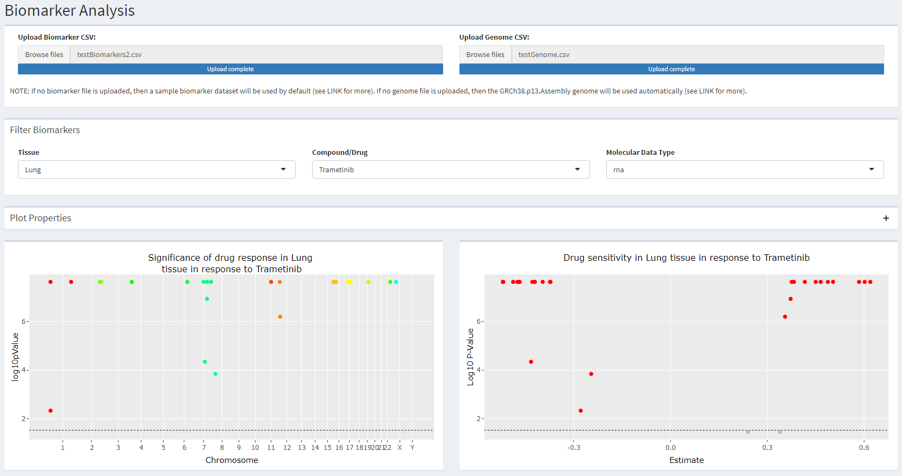
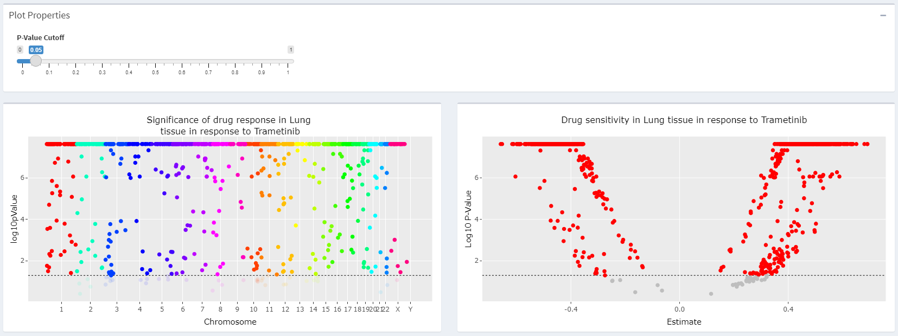
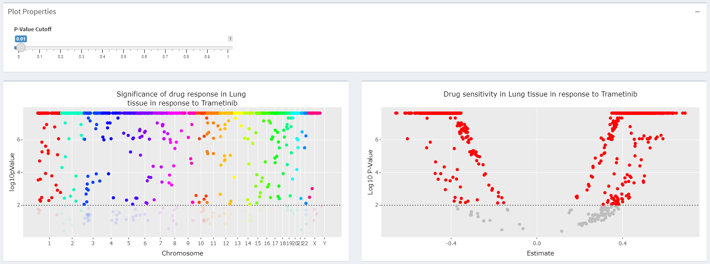
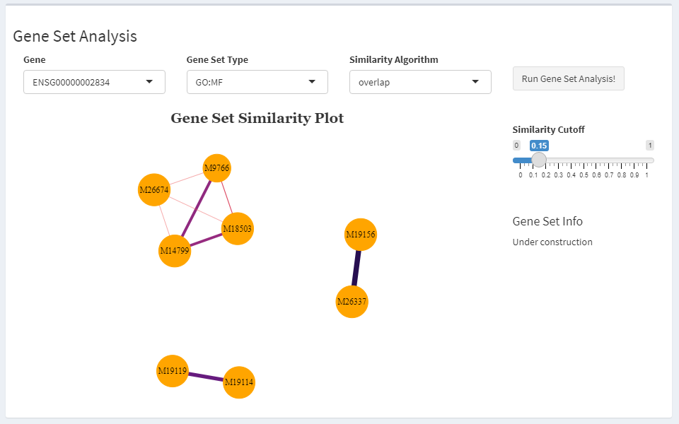
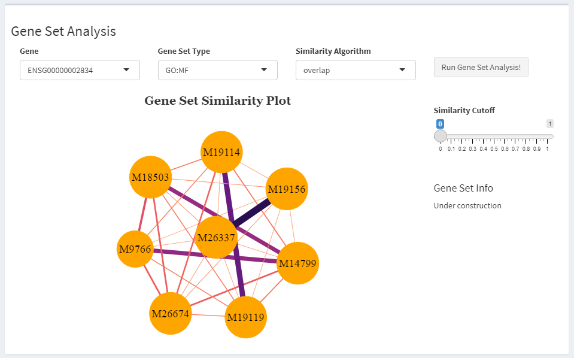
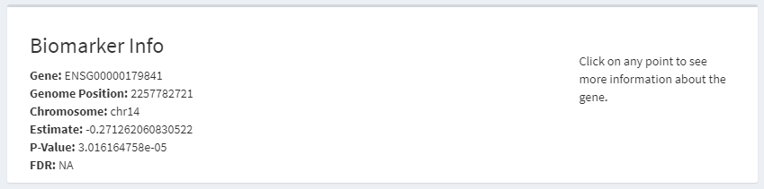
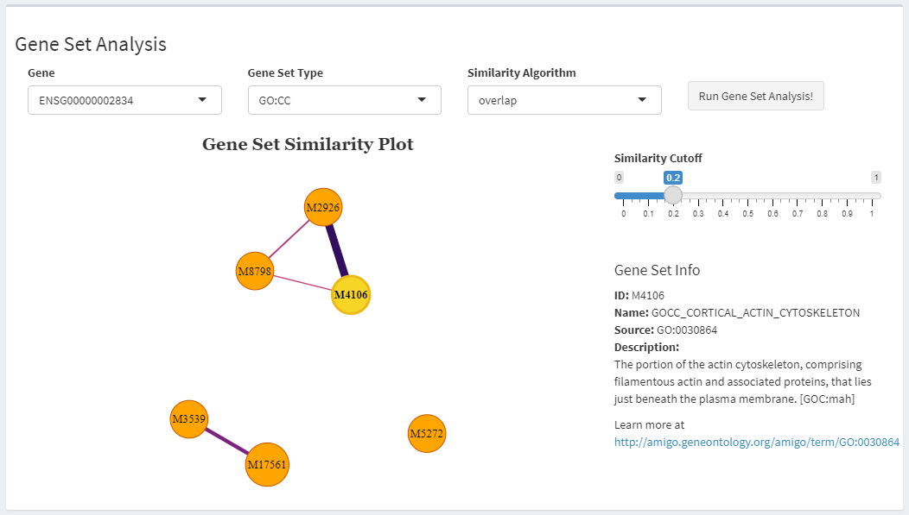

```{r setup, include=FALSE}
library(knitr)
opts_chunk$set(fig.align = "center", 
               out.width = "90%",
               fig.width = 8, fig.height = 6,
               dev.args=list(pointsize=10),
               par = TRUE, # needed for setting hook 
               collapse = TRUE, # collapse input & ouput code in chunks
               warning = FALSE)

knit_hooks$set(par = function(before, options, envir)
  { if(before && options$fig.show != "none") 
       par(family = "sans", mar=c(4.1,4.1,1.1,1.1), mgp=c(3,1,0), tcl=-0.5)
})
```
       
## Introduction

The process of developing new cancer drugs has many phases. New compounds are 
first tested on _in vitro_ cancer cell-lines, then the top candidates are 
tested _in vivo_ on patient-derived xenografts in mice. Once these extensive 
pre-clinical trials are done, drugs can finally progress to clinical trials. 
New therapeutics are only administered to patients that have a good chance of 
responding positively to the drug, as it would be unethical to intentionally 
prescribe drugs to patients who are likely to have resistance to that drug.

Molecular tumour boards are meetings between physicians, clinicians, providers, 
and other specialists decide on the best treatment plan for a specific cancer 
patient. Pre-clinical trials for candidate drugs are taken into consideration, 
especially when analyzing drugs with little to no clinical data. However, due 
to the huge amount of preclinical data that is often available, there is a need 
for tools which help filter, process, and visualize that data, to make tumour 
boards more efficient and effective.

**PGxVision** is a graphical R package designed to fit this need. It provides a 
set of functions for visualizing drug sensitivity data from preclinical trials 
(__*buildManhattanPlot*__, __*buildVolcanoPlot*__, __*buildWaterfallPlot*__). 
Such plots make it easy for clinicians to identify RNA-based biomarkers. 
Specifically, these graphs let users see which genes are correlated most 
strongly with high sensitivity to a compound. **PGxVision** also provides a set 
of analytical functions for interpreting and contextualizing biomarkers. Once 
clinicians have identified a gene of interest in the graphs, they can use 
__*getGeneSets*__ to explore what biological pathways that gene is involved in. 
Furthermore, they can use __*expandGeneSets*__, __*computeGeneSetSimilarity*__, 
and __*buildNetworkPlot*__ to compute and visualize the overlap in the pathways.
This similarity analysis can help connect the gene of interest to other 
biomarkers that have already been thoroughly studied, or it may provide a 
biological explanation for why the gene responds well to certain drugs. By 
facilitating the visualization and interpretation of preclinical 
pharmacogenomic data, **PGxVision** will allow clinicians to better predict how 
their patients will respond to specific cancer therapies.

To ensure robust drug sensitivity analysis, **PGxVision** is intended to be 
used with data from the BHKLab-Roche RNA-based drug response prediction 
pipeline, which will thoroughly process and evaluate the reliability of 
preclinical data before it is visualized or analyzed further.
Future versions of **PGxVision** will also allows clinicians to upload their 
patient's data and will identify biomarkers found in preclinical trials within 
the patient's genome, to further inform predictions and prognoses.

The Shiny implementation of **PGxVision** is available as __*runPGxVision*__. 
For more information, see the [Shiny App](#shiny) subsection.. 

**This document gives a tour of PGxVision (version 0.1.0) functionalities.** 
It was written in R Markdown, using the 
[knitr](https://cran.r-project.org/package=knitr) package for production. 

<br>

## Package Installation and Overview

See `help(package = "PGxVision")` for further details. To cite this package, 
use `citation("PGxVision")`. To download **PGxVision**, run the following 
commands in the R console:

``` r
require("devtools")
devtools::install_github("EvgeniyaGorobets/PGxVision", build_vignettes = T)
library("PGxVision")
```

To list all functions and data available in the package:
``` r
ls("package:PGxVision")
data(package = "PGxVision")
```

<br>

## Plotting Biomarkers

### Manhattan Plot

Manhattan plots are most often used in GWAS studies, to map single-nucleotide 
polymorphisms (SNPs). However, **PGxVision** uses Manhattan plots to provide a 
genome-wide view of drug sensitivity in a certain tissue.

In the example below, we select for data points showing how genes in the 
lymphoid tissues responded to Nvp-tae 684 treatment. We use the default 
`pValueCutoff=0.05`.

``` {r, fig.width = 8, fig.height = 6}
 resultMan <- PGxVision::buildManhattanPlot(
   biomarkerDf = PGxVision::Biomarkers, 
   chromosomeDf = PGxVision::GRCh38.p13.Assembly, 
   tissue = "Lymphoid", compound = "Nvp-tae 684", mDataType = "rna")
 resultMan$plot

```

Each point in the above plot corresponds to a gene, and its location along the 
x-axis is determined by the starting location of that gene (
`Biomarkers$gene_seq_start`). Each chromosome has its own color so that users 
can easily distinguish genes belonging to different chromosomes. The horizontal 
line reflects the selected `pValueCutoff`. Points below the line are 
semi-transparent to show that they do not meet our significance requirements. 
The higher a point is, the more significant its drug response was in 
experiments.

The function also returns the `data.table` that is plotted, so that users can 
examine the data in more detail. If desired, users can pass custom axis labels 
and a custom title to the function to override the default plot labels. 

<br>

### Volcano Plot

Volcano plots are most often used to plot the results of a differential gene 
expression analysis, to highlight genes that are significantly differentially 
expressed between two samples. **PGxVision** uses the same concept to plot drug 
sensitivity data.

In the example below, we again select drug response data for genes in 
lymphoid tissues exposed to Nvp-tae 684. We use the default 
`pValueCutoff=0.05`, to match the significance cutoff in the Manhattan plot.

``` {r, fig.width = 8, fig.height = 6}
 resultVol <- PGxVision::buildVolcanoPlot(
   biomarkerDf=PGxVision::Biomarkers, tissue = "Lymphoid", 
   compound = "Nvp-tae 684", mDataType = "rna")
 resultVol$plot

```

On the right side (`estimate > 0`), we see genes that are sensitive to Nvp-tae 
684 treatment. On the left (`estimate < 0`), we see genes that are resistant to 
Nvp-tae 684 treatment. The horizontal line reflects our `pValueCutoff`. Points 
below the line are grayed out to show that their sensitivity or resistance is 
not statistically significant. 

The function also returns the `data.table` (`result$dt`) that is plotted, so that 
users can examine the data in more detail. If desired, users can pass custom 
axis labels and a custom title to the function to override the default plot 
labels. 

<br>

### Waterfall Plot

Waterfall plots are another useful way to visualize multi-dimensional 
pharmacogenomic data. The bar plot format is sometimes easier to interpret than 
scattered points (especially when using color to graph another facet of the 
data), and the ordering of the bars by the y-axis makes it easy to 
find the most and least extreme results.

Instead of using cell-line data, we will use a waterfall plot to plot PDX data. 
In the example below, we load a data set of BRCA xenografts that were treated 
with paclitaxel (data taken from the Xeva package), and we plot the angle 
between the treatment and control tumours. We color the bars according to the 
level of ODC1 transcript expression in the tumours. ODC1 is the gene that 
encodes Ornithine decarboxylase in humans. Ornithine decarboxylase is the rate-
limiting enzyme in the polyamine biosynthesis pathway in humans, and is known 
to have elevated activity in cancer cells.

``` {r, fig.width = 8, fig.height = 6}
 PGxVision::buildWaterfallPlot(PGxVision::BRCA.PDXE.paxlitaxel.response,
                               xAxisCol="tumour", drugSensitivityCol="angle",
                               colorCol="ODC1", xLabel="Tumour",
                               yLabel="Angle Between Treatment and Control",
                               title="Paclitaxel Response in BRCA Tumours")

```

This plot shows no obvious correlation between ODC1 transcript levels and 
paclitaxel response (Li, J., et al., 2020). Alternatively, users can make 
waterfall plots with different compounds along the x-axis 
(`xAxisCol="compound`), to see which drugs are most effective at treating a 
specific PDX in mice. Similarly, users can color bars by their p-value or 
significance (`colorCol="pValue"`). The only constraints are that data plotted 
along the x-axis must be discrete, represented by a character vector, and 
data plotted along the y-axis or used for coloring the bars must be continuous, 
represented by a numeric vector. If desired, users can pass custom axis labels 
and a custom title to the function to override the default plot labels. 

<br>

## Gene Set Analysis

The gene set analysis functions provided by **PGxVision** are intended to go 
hand-in-hand with the plotting functions above. The idea behind gene set 
exploration is to contextualize genes of interest. 

By examining the `data.table`s returned in the Manhattan and Volcano plot 
examples above, we might notice that gene ENSG00000000971 is correlated with a 
positive drug sensitivity estimate (`estimate = 0.5871447`) with high 
significance (`pvalue = 2.356379e-08 < 0.05`). (We could also observe this by 
interacting with the plots in the [Shiny App](#shiny).)

``` {r}
 geneId <- "ENSG00000000971"
 resultMan$dt[gene == geneId & tissue == "Lymphoid" & compound == "Nvp-tae 684", 
              list(gene, compound, tissue, estimate, pvalue)]

```

To understand why this gene is correlated with high Nvp-tae 684 sensitivity, we 
should look at the biological pathways that it is involved in. We can do this 
by using the __*getGeneSets*__ function. We use `queryType="GO:BP"` to indicate 
that we want to explore gene sets that correspond to GO biological pathways.

``` {r}
 geneSetInfo <- PGxVision::getGeneSets(geneId = "ENSG00000000971", 
                                       queryType ="GO:BP")
 head(geneSetInfo)

```
The result is a `data.table` of gene sets from MSigDb. Each row represents one 
gene set, and provides useful information, such as the gene set name, 
description, and URL. For example, gene set M15770 (row 3 in `geneSetInfo`) has 
the name "GOBP_CELL_KILLING", and is defined as "Any process in 
an organism that results in the killing of its own cells or those of another 
organism, including in some cases the death of the other organism. Killing here 
refers to the induction of death in one cell by another cell, not 
cell-autonomous death due to internal or other environmental conditions". 

However, looking at a long list of gene sets can be overwhelming and not 
particularly useful. It would help to first group the gene sets that are most 
closely associated with each other, such as GOBP_CELL_KILLING and 
GOBP_REGULATION_OF_CELL_KILLING (M16351), which are both related to cell 
killing. **PGxVision** lets users group gene sets by comparing their component 
genes and calculating the pairwise intersection.

In the example below, we use the __*expandGeneSets*__ function to first find 
all the genes in each gene set, and then we use __*computeGeneSetSimilarity*__ 
to compute the similarity score for each pair of gene sets. We use the default 
`similarityMetric="overlap"` (number of intersecting genes / number of total 
unique genes). Future versions of **PGxVision** will support more complex 
similarity metrics.

``` {r}
 geneSets <- PGxVision::expandGeneSets(geneSetIds = geneSetInfo$gs_id, 
                                       geneSetType = "GO:BP")
 similarityScores <- PGxVision::computeGeneSetSimilarity(geneSets)
 head(similarityScores)

```

To let users run all those steps at once, from querying the gene to computing 
the similarity, **PGxVision** provides the __*geneSetAnalysis*__ function. 

``` {r, fig.width = 8, fig.height = 6}
 analysisResults <- PGxVision::geneSetAnalysis(geneId = "ENSG00000000971", 
                                               queryType="GO:BP")
 head(analysisResults$geneSets, n=3)
 head(analysisResults$similarityDf, n=3)

```

This function provides both the gene set information retrieved by 
__*getGeneSets*__ (`analysisResults$geneSets`) and the gene set similarity 
scores computed by __*computeGeneSetSimilarity*__ 
(`analysisResults$similarityDf`). Users should note that this function takes a 
while to run because of the MSigDb queries.

Now that we have the similarity scores, we can visualize how the gene set 
groups using a network plot. The __*buildNetworkPlot*__ function creates a 
network plot with gene sets as the nodes, and edges that are determined by 
the similarity scores. The more overlap there is between two gene sets, the 
closer the nodes will be, and the thicker and darker the edge between them will 
be. For now, we override the default cutoff and set `similarityCutoff=0` to 
plot all the edges.

``` {r, fig.width = 8, fig.height = 6}
 PGxVision::buildNetworkPlot(gsSimilarityDf = similarityScores, 
                             similarityCutoff = 0)

```

Unfortunately, the abundance of thin, light-colored edges in this plot 
(indicating low similarity between gene sets) obscures the thicker edges and 
makes it difficult to distinguish the gene set groupings. For this reason, the 
default `similarityCutoff` is set to 0.5.

``` {r, fig.width = 8, fig.height = 6}
 PGxVision::buildNetworkPlot(gsSimilarityDf = similarityScores)

```
In this graph, we can clearly see that gene sets M15770 and M16351 have 
significant (>= 0.5) overlap. We can also see that the biological pathways that 
ENSG00000000971 is involved in can be roughly grouped into ten categories (five 
connected groups of nodes, and five individual nodes). 
This makes it much easier for clinicians to see the bigger biological picture 
and to start reasoning about why ENSG00000000971 correlates with Nvp-tae 684 
sensitivity in lymphoid tissues. To help examine larger 
network plots such as this one, zooming and panning have been implemented.


To get a list of all possible query types, you can use the `msigdbr` package:

``` {r}
 msigdbr::msigdbr_collections()$gs_subcat

```
Visit https://www.gsea-msigdb.org/gsea/msigdb/genesets.jsp to learn more about 
different types of gene sets (Subramanian, et al., 2005).

<br>

## Shiny App {#shiny}

Users can run the **PGxVision** Shiny app by running 
`PGxVision::runPGxVision()`. The app is organized as a dashboard with two tabs. 
The "Biomarkers" tab lets users plot the drug sensitivity signatures of 
potential biomarkers on Manhattan and Volcano plots, and additionally lets 
users further explore biomarkers through gene set analysis.
The "Treatment Response" tab lets users examine how different tumour samples 
responded to a compound, or how the same tumour sample responded to different 
compounds, by plotting the treatment response statistics on a waterfall plot.
Users can upload biomarker, genome, and drug sensitivity data through the file 
upload boxes located at the top of each tab.

The Shiny app has several advantages over traditional use of **PGxVision**:
* [Easier Plotting](#easier-plotting)
* [Interactivity](#interactivity)
* [Fewer Errors](#fewer-errors)
 
### Easier Plotting {#easier-plotting}

The **PGxVision** Shiny app makes plotting easier by letting users render 
multiple graphs at the same time. Instead of individually creating the 
Manhattan and volcano plots, users simply upload the files containing their 
biomarker data, select the experiment (tissue, compound, mDataType) they're 
interested in, and both plots are automatically rendered. 

{width=700px}

This side-by-side layout allows users to see more information at once, so they 
have a better understanding of the data.

<br>

To adjust the p-value cutoff, users can move the slider located in 
"Plot Properties", and both plots will be re-generated automatically.

{width=700px} 
{width=700px}

<br>

Similarly, there is a slider for adjusting the similarity cutoff in the network 
plot. Moving the slider will automatically re-render the network plot.

{width=700px} 
{width=700px}

<br>

### Interactivity {#interactivity}

The biggest benefit of the **PGxVision** Shiny app is that it allows users to 
interact with the plots. On the Manhattan and volcano plots, users can hover 
over any point to see its exact x and y coordinates.

{width=700px}
{width=700px}

<br>

To see even more information about the data point, users can click on it. The 
"Biomarker Info" box, located directly below the plots, will populate with 
additional details about the data point, such as which gene it 
corresponds to, its p-value (without the log10 transformation), and its false 
discovery rate (FDR). 

{width=700px}

<br>

The gene set similarity network plot is also interactive. Users can click on 
any node to select it (the selected node will be yellow instead of orange). 
Once a node is selected, the "Gene Set Info" box, located to the right of the 
network plot, will populate with information about the gene set represented by 
that node, including a link to more information.

{width=700px}

<br>

These interactivity features make it much easier for users to explore the 
drug sensitivity data and focus in on genes of interest. Interactivity in the 
waterfall plot has not yet been implemented, but will be in future versions 
of **PGxVision**.

<br>

### Fewer Errors {#fewer-errors}

The **PGxVision** Shiny app also steers users away from making erroneous 
function calls. For instance, the "Tissue", "Compound", and "Molecular Type" 
dropdowns (located in the "Filter Biomarkers" box) will only contain tissues, 
compounds, and molecular types that are in the uploaded dataset. This prevents 
users from attempting to select for tissues/compounds/mDataTypes that are not 
in the dataset.

Similarly, the "x-Axis", "y-Axis", and "Color" dropdowns (located in the 
"Treatment Response" tab) will only contain columns that satisfy the data type 
requirements for the waterfall plot. Specifically, the "x-Axis" dropdown will 
only contain columns from the uploaded dataset that are of class "character" 
(i.e., discrete data), while the "y-Axis" and "Color" dropdowns will only 
contain columns from the uploaded dataset that are of class "numeric" (i.e., 
continuous data). This stops users from accidentally trying to plot discrete 
data on a continuous axis or vice-versa, therefore preventing the app from 
throwing errors.

<br>

## References

### Content References

Li, J., Meng, Y., Wu, X. et al. (2020). Polyamines and related signaling 
  pathways in cancer. _Cancer Cell Int 20_, 539. 
  https://doi.org/10.1186/s12935-020-01545-9

Subramanian, A., Tamayo, P., Mootha, V. K., Mukherjee, S., Ebert, B. L., 
  Gillette, M. A., … Mesirov, J. P. (2005). Gene set enrichment analysis: 
  A knowledge-based approach for interpreting genome-wide expression profiles. 
  _Proceedings of the National Academy of Sciences, 102_(43), 15545–15550. 
  doi:10.1073/pnas.0506580102

### Data References

Feizi, N., Nair, S. K., Smirnov, P., Beri, G., Eeles, C., Esfahani, P. N., … 
  Haibe-Kains, B. (2021). PharmacoDB 2.0: Improving scalability and 
  transparency of in vitro pharmacogenomics analysis. _bioRxiv._ 
  doi:10.1101/2021.09.21.461211
  
Frankish, A., Diekhans, M., Ferreira, A. M., Johnson, R., Jungreis, I. 
  Loveland, J., Mudge, J. M., Sisu, C., Wright, J., Armstrong, J., Barnes, I., 
  Berry, A., Bignell, A., Carbonell Sala, S., Chrast, J., Cunningham, F., Di \
  Domenico, T., Donaldson, S., Fiddes, I. T., García Girón, C., … Flicek, P. 
  (2019). GENCODE reference annotation for the human and mouse genomes. 
  _Nucleic acids research, 47_(D1), D766–D773. 
  https://doi.org/10.1093/nar/gky955

Mer A, Haibe-Kains B (2021). Xeva: Analysis of patient-derived xenograft (PDX) 
  data. R package version 1.10.0.

Subramanian, A., Tamayo, P., Mootha, V. K., Mukherjee, S., Ebert, B. L., 
  Gillette, M. A., … Mesirov, J. P. (2005). Gene set enrichment analysis: 
  A knowledge-based approach for interpreting genome-wide expression profiles. 
  _Proceedings of the National Academy of Sciences, 102_(43), 15545–15550. 
  doi:10.1073/pnas.0506580102

----

```{r}
sessionInfo()
```
